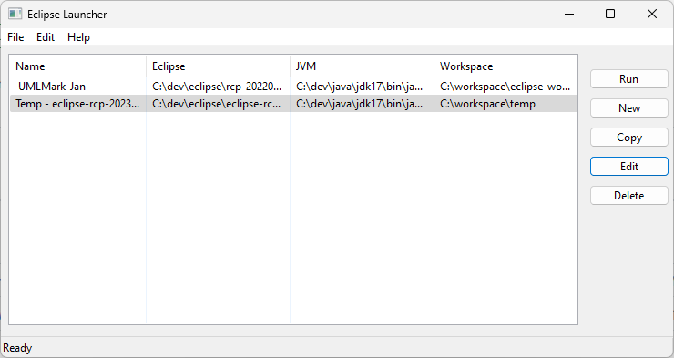
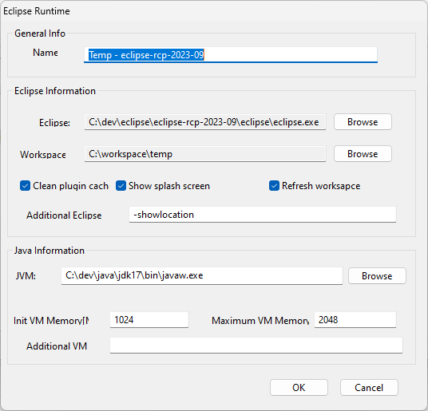

# Peppermint Eclipse Launcher

The Peppermint Eclipse Launcher stands as a standalone wxPython application, offering a user-friendly UI for efficiently managing Eclipse installations, JDK configurations, and Eclipse workspaces. This tool is an integral part of the [UMLMark](https://github.com/petercai/UMLMark-release) development and testing.

